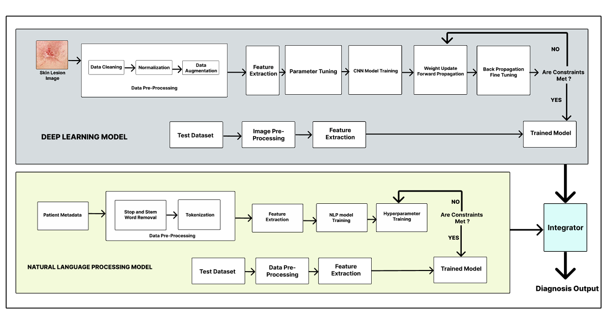

# DermaScan AI: Skin Lesion Classification of Dermatoscopic Images using Deep Learning and NLP Techniques

A comprehensive project that integrates state-of-the-art deep learning and NLP methods to diagnose skin lesions. By leveraging the HAM10000 dataset, the system combines image classification, lesion segmentation, and text analysis to produce robust and reliable predictions.

---

## Table of Contents

- [Overview](#overview)
- [Project Architecture](#project-architecture)
- [Features](#features)
- [Directory Structure](#directory-structure)
- [Installation](#installation)
  - [Frontend Setup](#frontend-setup)
- [Usage](#usage)
- [Contributing](#contributing)
- [License](#license)
- [Acknowledgements](#acknowledgements)

---

## Overview

This project focuses on the classification of dermatoscopic images to diagnose skin lesions using a multi-modal approach:
- **Image Analysis:** Utilizes a pre-trained ResNet50 model for classifying images.
- **Lesion Segmentation:** Implements U-Net for precise segmentation of skin lesions.
- **NLP Analysis:** Applies a Random Forest classifier to process textual metadata, enhancing the diagnostic outcome.
- **Combined Prediction:** Merges outputs from both the CNN and NLP pipelines to provide comprehensive classification results.

The project is structured with a modern, responsive frontend built with React and Vite, and a Flask backend that serves the prediction APIs.

---

## Project Architecture

- **Data Source:** HAM10000 dermatoscopic image dataset.
- **Image Classification:** 
  - **Model:** Pre-trained ResNet50.
- **Lesion Segmentation:** 
  - **Model:** U-Net.
- **Text Analysis:**
  - **Model:** Random Forest for processing associated text and metadata.
- **Integrated Output:** Combines the strengths of CNN-based image processing and NLP techniques.
- **Frontend:** Built with React + Vite (located in the `client/` folder).
- **Backend:** Flask API for handling requests and predictions.

---

## Features

- **Robust Multi-Modal Analysis:** Combines deep learning and NLP to enhance diagnostic accuracy.
- **Advanced Segmentation:** Uses U-Net to isolate lesions, improving classification precision.
- **Modern UI/UX:** A clean, aesthetic, and responsive interface built with React and Vite.
- **Efficient API:** Flask-powered backend for real-time prediction serving.
- **Modular Architecture:** Easy to understand, extend, and deploy.

---

## Directory Structure

```
.
├── client/           # Frontend built with React + Vite
├── data/             # HAM10000 dataset and preprocessing scripts
└── README.md         # Project documentation
```

---

## Installation

### Frontend Setup

1. **Navigate to the Client Folder:**

   ```bash
   cd client
   ```

2. **Install Node Dependencies:**

   ```bash
   npm install
   ```

3. **Start the Development Server:**

   ```bash
   npm run dev
   ```

---

## Usage

1. **Access the Frontend:**
   - Open your browser and navigate to the URL provided by the React development server (typically [http://localhost:3000](http://localhost:3000)).

2. **Upload an Image:**
   - Use the interface to upload dermatoscopic images for analysis.

3. **Prediction Process:**
   - The image is segmented using U-Net.
   - The pre-trained ResNet50 model classifies the image.
   - The NLP pipeline processes any additional textual data.
   - The backend merges the outputs to provide a comprehensive diagnosis.

4. **View Results:**
   - The combined prediction is displayed on the frontend, offering clear insights into the lesion classification.

---
### Architectural Diagram


## Contributing

Contributions are welcome! If you have ideas or improvements, please follow these steps:

1. Fork the repository.
2. Create a feature branch (`git checkout -b feature/YourFeature`).
3. Commit your changes (`git commit -m 'Add some feature'`).
4. Push to the branch (`git push origin feature/YourFeature`).
5. Open a Pull Request.

For major changes, please open an issue first to discuss what you would like to change.

---

## License

This project is licensed under the MIT License. See the [LICENSE](LICENSE) file for details.

---

## Acknowledgements

- **HAM10000 Dataset:** Providers and researchers who contributed to this valuable resource.
- **Model Architectures:** 
  - ResNet50 for image classification.
  - U-Net for image segmentation.
- **Open Source Community:** Developers and researchers contributing to the machine learning and web development ecosystems.

---
